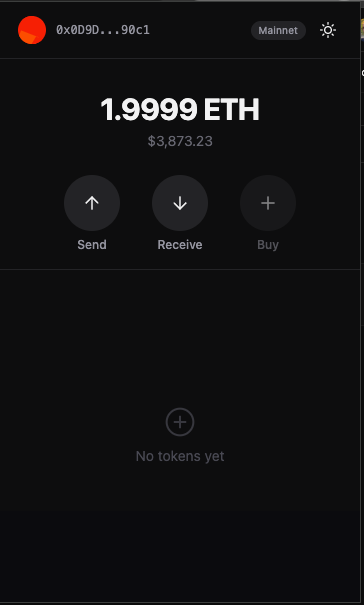
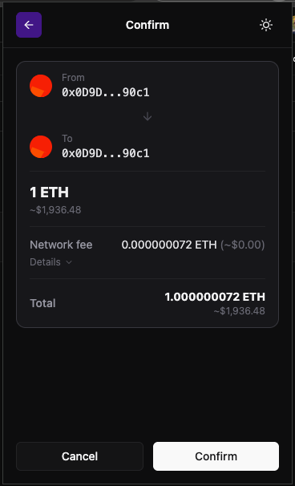
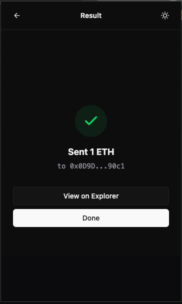

# vibewallet

A Chrome extension wallet for megaETH, built from scratch with React, TypeScript, and audited cryptography.

> **WARNING: This is an experimental project for educational and entertainment purposes only. Do NOT use this wallet on mainnet with real funds. There is no warranty, no audit, and no guarantee of security. You will lose your money. Seriously.**

## Screenshots

<p align="center">
  
  
  
</p>

## What is this

A fully functional browser extension wallet that talks to megaETH (the real-time Ethereum L2). It handles key generation, transaction signing, gas estimation, dapp connectivity, and a 4-screen send flow — all in ~1.4mb.

Built entirely through vibe coding with Claude Code. Every commit in the git history was AI-generated.

## Features

- BIP-39 mnemonic generation and import (12/24 words)
- BIP-44 HD key derivation (m/44'/60'/0'/0/n)
- AES-256-GCM vault encryption with PBKDF2 key stretching
- EIP-1559 Type 2 transaction signing
- Gas estimation with 60k minimum floor (megaETH's multidimensional gas)
- Realtime transaction submission via `realtime_sendRawTransaction`
- EIP-1193 provider injection + EIP-6963 wallet discovery
- Dapp connection approval, personal_sign, signTypedData_v4
- ETH/USD toggle with CoinGecko price feed
- Dark mode, multiple accounts, seed phrase export

## Architecture

```
popup (React)          content script           background (SW)
  Zustand store    -->   message relay      -->   key management
  send flow UI          window.postMessage        tx signing
  dapp approval         chrome.runtime            RPC calls
                                                  gas estimation
```

Three isolated execution contexts per Manifest V3:
- **Popup**: React UI, no access to keys
- **Content script**: message relay between page and background
- **Background service worker**: holds encrypted vault, signs transactions, makes RPC calls

## Tech stack

| Layer | Choice |
|-------|--------|
| Crypto | `@noble/curves`, `@noble/hashes`, `@scure/bip32`, `@scure/bip39` |
| Signing | `micro-eth-signer` |
| UI | React 19, Tailwind CSS 4, shadcn/ui |
| State | Zustand |
| Build | esbuild (deterministic, reproducible) |
| Test | Vitest |
| Lint | Biome |

Zero-dependency crypto libraries only. No ethers.js, no viem, no web3.js.

## Setup

```bash
pnpm install
pnpm build
```

Load `dist/` as an unpacked extension in `chrome://extensions` (enable Developer mode).

### Development

```bash
pnpm dev        # watch mode
pnpm typecheck  # tsc --noEmit
pnpm lint       # biome check
pnpm test       # vitest
```

## Project structure

```
src/
  entrypoints/
    background.ts    # service worker: vault, signing, RPC, dapp routing
    content.ts       # message relay (page <-> background)
    inpage.ts        # EIP-1193 provider injected into page world
  features/
    wallet/
      crypto/        # mnemonic, HD derivation, vault encryption
      rpc/           # gas estimation, RPC calls, network config
      tx/            # transaction building, signing, formatting
      store.ts       # Zustand state
      messages.ts    # popup <-> background message types
    ui/
      screens/       # Welcome, Main, Send flow (4 screens), Settings, About
      components/    # Header, Sidebar, BalanceDisplay, ActionButtons
  components/ui/     # shadcn primitives (Button, Input, etc.)
tests/
  crypto/            # mnemonic, HD, vault, address, integration
  tx/                # serialization, gas, nonce
  provider-isolation.test.ts
  build.test.ts
  pins.test.ts
```

## Security model

- Private keys never leave the background service worker
- Vault encrypted with AES-256-GCM, key derived via PBKDF2 (600k iterations)
- All crypto uses `@noble`/`@scure` (audited, zero-dep, by Paul Miller)
- Provider is `Object.freeze()`'d — no mutable state exposed to dapps
- Content script never sees key material
- CSP: `script-src 'self'; object-src 'self'`
- Exact version pins on all dependencies (no ^ or ~)

## Disclaimer

**THIS SOFTWARE IS PROVIDED "AS IS", WITHOUT WARRANTY OF ANY KIND.** This is a hobby project, a learning exercise, a vibe. It has not been audited. It has not been reviewed by security professionals. It almost certainly contains bugs that could result in total loss of funds.

**Do not use this on mainnet. Do not store real cryptocurrency. Do not trust this with anything of value.**

If you ignore this warning and lose money, that's on you. You were warned — repeatedly, emphatically, in all caps.

## License

MIT
